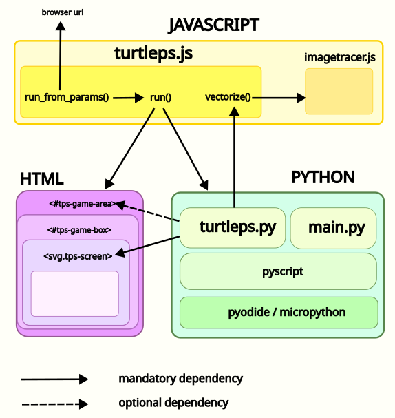

# TurtlePS Game Engine Design

## Architecture

### Architecture requirements 

- **no server (almost)**: TurtlePS should be able to run on any simple static web server without expecting any particular configuration. If users don't have a server, they can connect to a simple static pseudoserver page that fetches files from their own computer without storing on the server thanks to HTML5 features, for example https://github.com/CoderDojoTrento/pseudoserver 
- **no IDE**:  you should be able to edit your games directly with the developer tools of your browser, without need to install anything. For now we explicitly support Chrome Dev Tools.
- **Develop with browser cache enabled**: the software should be able to version file urls so to selectively bust browser cache when you need to update some specific files (even if you don't own/control the server)

### Python

- **Fully support Pyodide** (= CPython environment), best effort support for micropython (but that would only be useful for most demanding users, which are not our target)
- **fast reload**: users should be able to fast reload working files even when developing with Pyodide
- **embrace `await/async` model**:
TurtlePS lives in the browser, which is a single threaded environment, so we should use `await/async` model. It does bring some extra complexity with it but it's very useful to learn anyway (nowadays you could have ways around that like workers, svg animations, python without GIL, but those would bring in add other problems)

### Javascript

User shouldn't be required to edit Javascript files.

* `turtleps.js`: convenience minimal Javascript  library which deals with performance matters (like image tracing) and tooling, like running python interpreter, versioning and displaying module descriptions in markdown.

### HTML

User shouldn't be required to edit HTML files.

* `index.html`: normal page to work on, loads `main.py`
* `test.html`: fetches scripts from `test/` folder using config generated from [test/pyscript-test-template.json](test/pyscript-test-template.json)
* `demo.html`: fetches scripts from `demo/` folder and loads pyscript.json
* `minimal.html`: stripped down example for integrating turtleps into your own system with minimal dependencies, see [demo page](https://coderdojotrento.github.io/turtle-pyscript/minimal.html) and [source](minimal.html)

